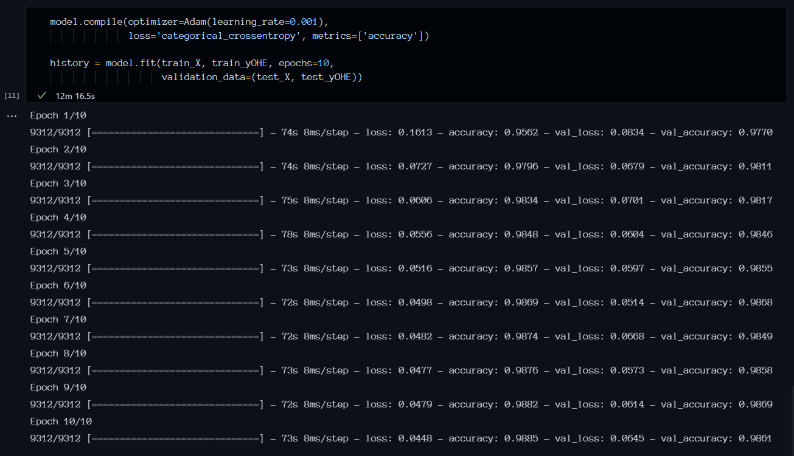

# Handwritten Text Recognition

This is a little test to implement the things I learnt from my Machine Learning class.

I've set up main.py into cells for ease of running the code.

## Data

I used some data from Kaggle.
You can download it from [here](https://www.kaggle.com/sachinpatel21/az-handwritten-alphabets-in-csv-format).

## Output

First I displayed a bar graph of the number of elements we had per letter in the alphabet.


Then we took the elements data and turned it into images we can plot for both humans and the computer to recognize.


We then trained the model. Epochs = 10.



Here is the output of:

```py3
model.summary()
```


Displayed out accuracy.


And then made a prediction using our testing data.


